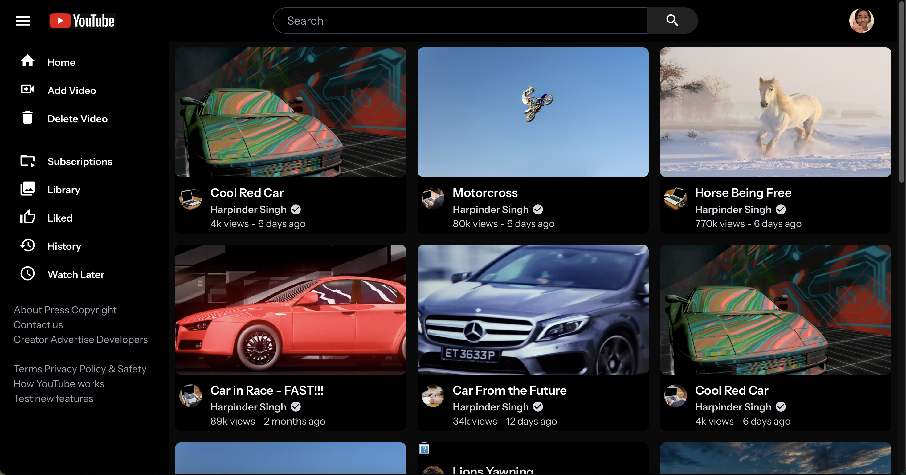
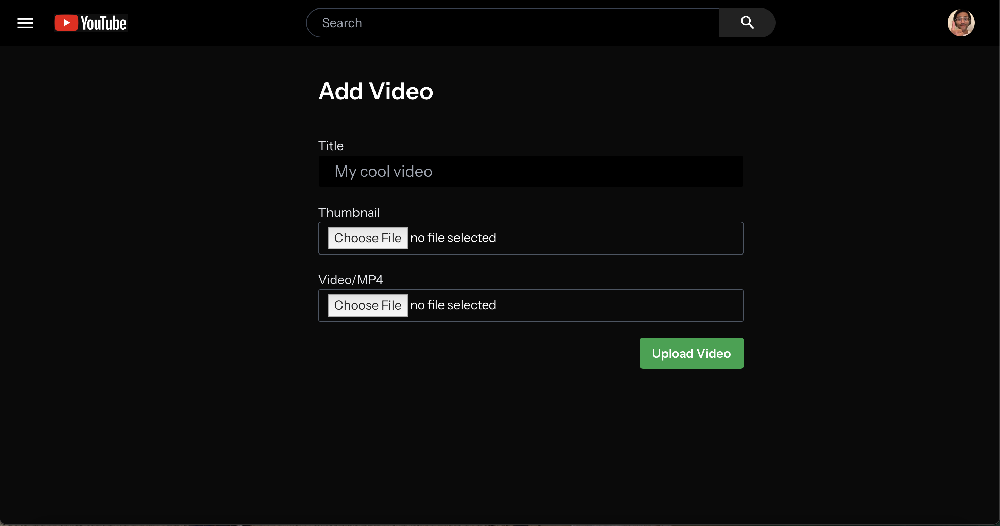
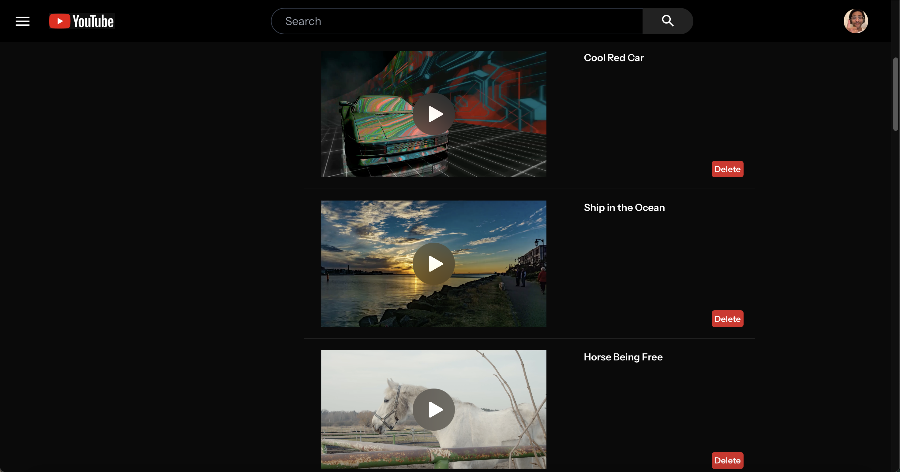
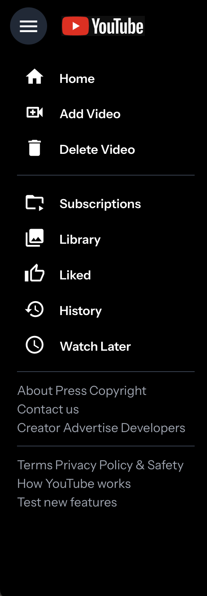

# Welcome
## About
This is a YouTube Clone I maade using Laravel 22 and Vue. This was done mainly so I can gain more experience with backend programming.
I used TablePLus for the local database, just because I didn't think I needed to go to a huge MySQL API. I watched a tutorial on John 
Weeks channel that served as the base of what I made here. I was a little old so I did have to look around, but ultimately it was worth 
it!

## Features
I made a landing page that displays all the videos in a random order:

Landing Page:

I also made a way to add a video:

Add Video Page:

I also made a way to delete a video:

Delete Page:

A NavBar was also made:
NavBar:

